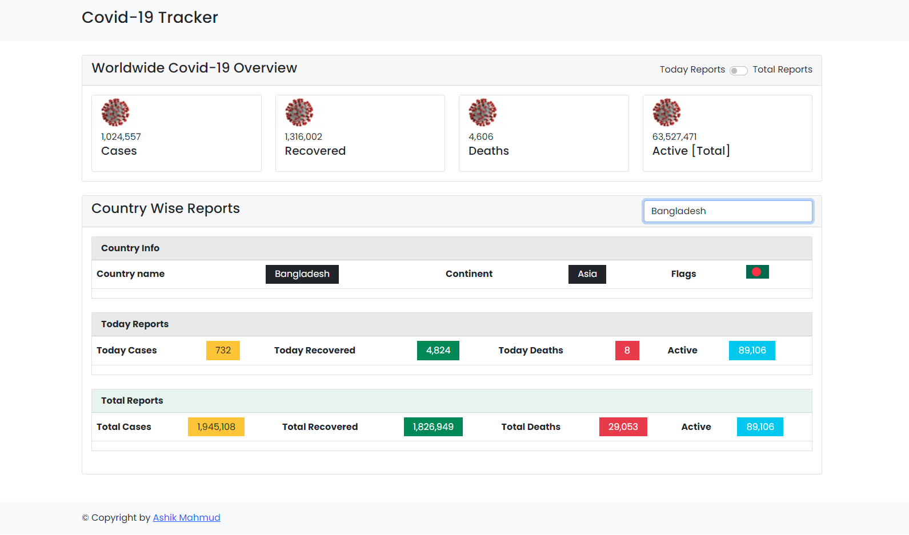

# Covid-19 Tracker in JavaScript API

This simple covid 19 tracker in api. here you will see individual country report filter by country name & also you will get a global country reports with toggle system.

# Using Technologies
- HTML5/HTML
- CSS/CSS3
- Bootstrap Framework
- Vanilla JavaScript
- DOM Manipulation
- Covid-19 API
- VS Code Editor
- Github / Git bash
- Windows Terminal
& many more....

# Features
- Get a global reports overview 
- Toggle system for Today & Total Report
- Also you can see the report individually by name of country
- Fancy Preloader & Error

# Demo Link in the about section

# Preview Demo for this Application

> Thanks for reach out me on github.